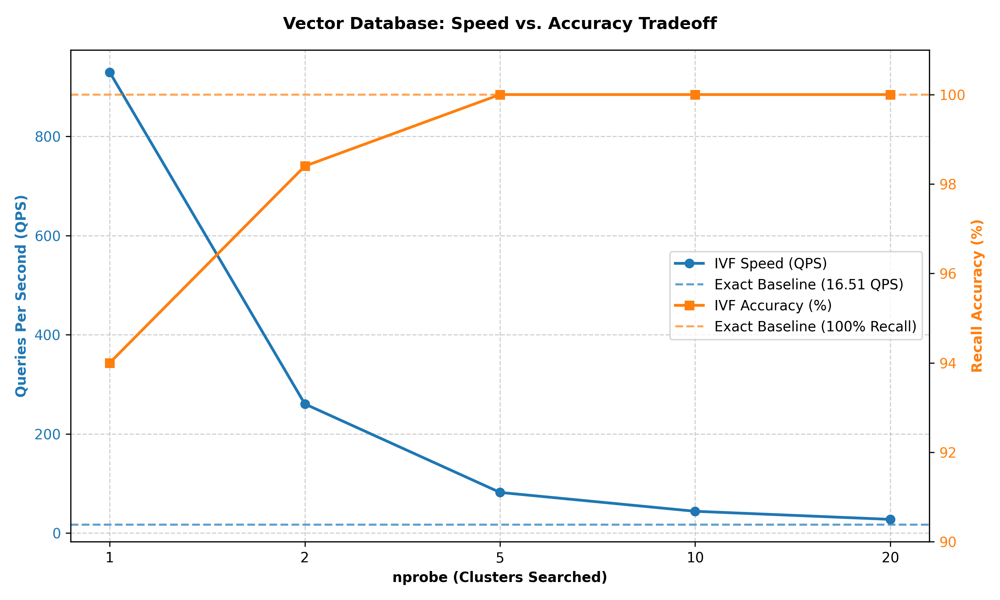

# Custom Vector Database: Exact vs. Approximate Search

This project implements a custom vector database from scratch using pure NumPy. It benchmarks an Exact Nearest Neighbor search against an Approximate Nearest Neighbor (ANN) Inverted File (IVF) index to demonstrate the algorithmic tradeoff between query speed and recall accuracy.

## Deliverables
* **Exact Index:** Brute-force cosine distance over 50,000 synthetic vectors.
* **Approximate Index:** K-means clustered IVF index.
* **Tradeoff Measurement:** Benchmarks plotting Queries Per Second (QPS) vs. Recall at various `nprobe` settings.

The 50,000 text embeddings are mocked using synthetically generated clustered vectors via a fixed NumPy random seed.


## Installation & Usage

1. Clone the repository.
2. Ensure `numpy` and `matplotlib` are installed:
   ```bash
   pip install numpy matplotlib
3. Run the interactive terminal interface to test search, insertion, and the deletion constraint:
   ```bash
   python app.py
4. Run the benchmarking script to execute the 500-vector query test and generate the tradeoff plot:
   ```bash
   python benchmark.py


## Performance Benchmark
The graph below illustrates the inverse relationship between query speed and recall accuracy as the `nprobe` hyperparameter increases.


## The Deletion Constraint
In an Inverted File (IVF) index, performing an in-place delete is computationally prohibitive. Our IVF structure relies on contiguous NumPy arrays for L2 distance vectorization and static memory pointers within the adjacency lists. Deleting a vector requires an O(N) reallocation of the underlying dense matrix, shifting all subsequent indices, which then forces a complete O(N) traversal and rebuild of the IVF adjacency lists to remap the shifted pointers. Additionally, frequent deletions degrade cluster centroid validity, necessitating a full K-means retraining cycle to prevent precision decay.